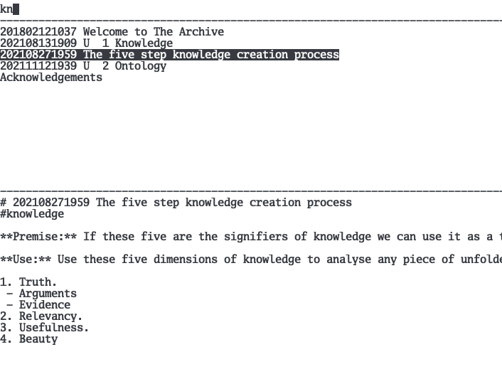

## nvterm

a notational velocity inspired note taking app.

### using

it'll load all files ending in `.md` in the current directory.

type search terms to filter down the list.

use `ctrl+{hknp}` to move up/down results.

press enter to open your `$EDITOR`.

enter with no result users search.

sync by editing from cloud folder.

### keybindings

- `enter` open selected result (or create new file named after current search)
- `ctrl+l` focus the search bar (and clear search)
- `right` cancel clearing search
- `ctrl+j` or `ctrl+n` select next result
- `ctrl+k` or `ctrl+p` select previous result
- `ctrl+q` or `ctrl+g` quit

### screenshot

### license

MIT
